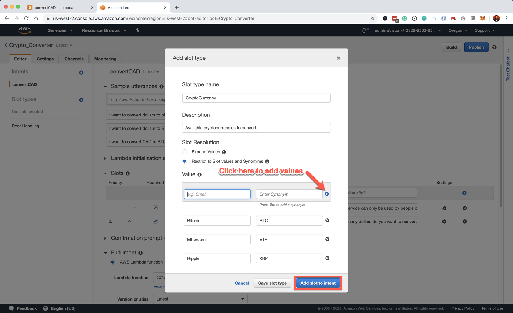
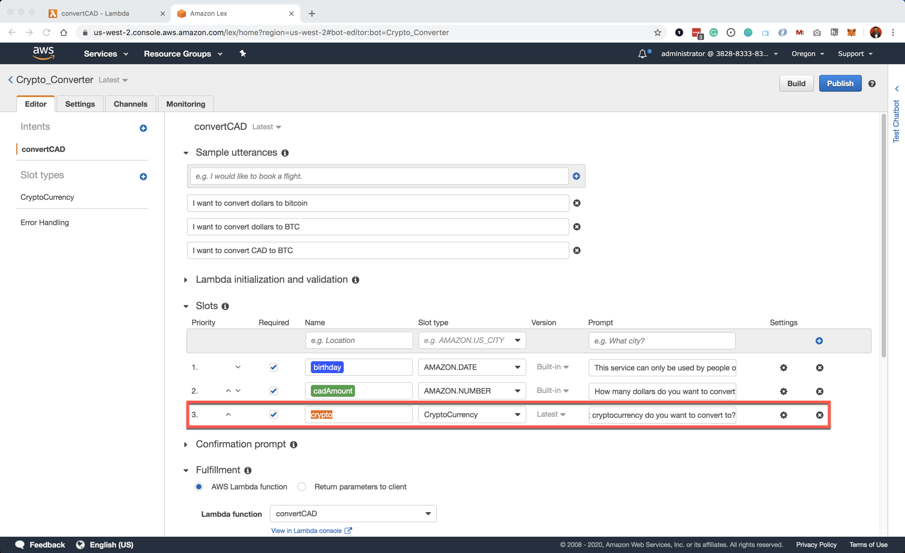
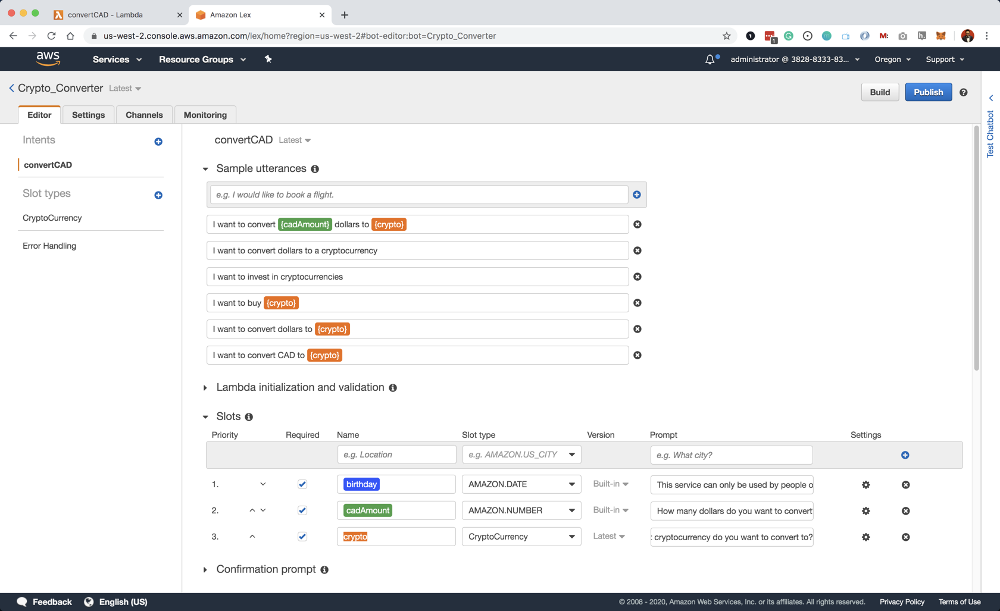
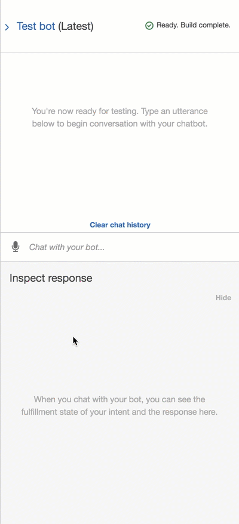
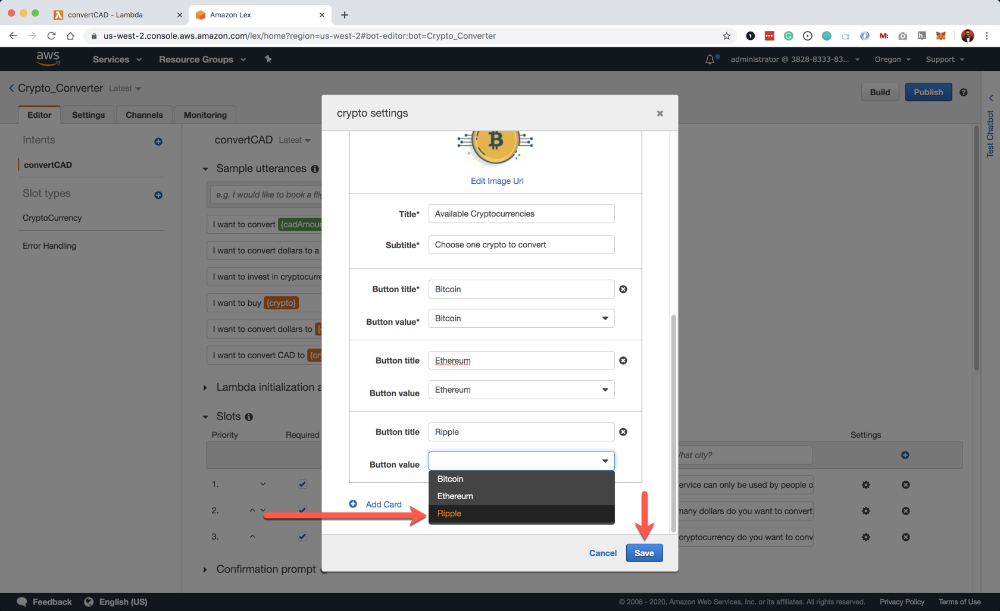
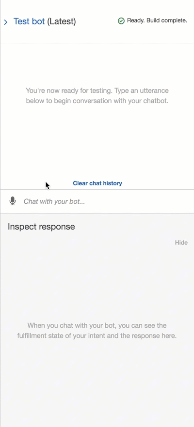
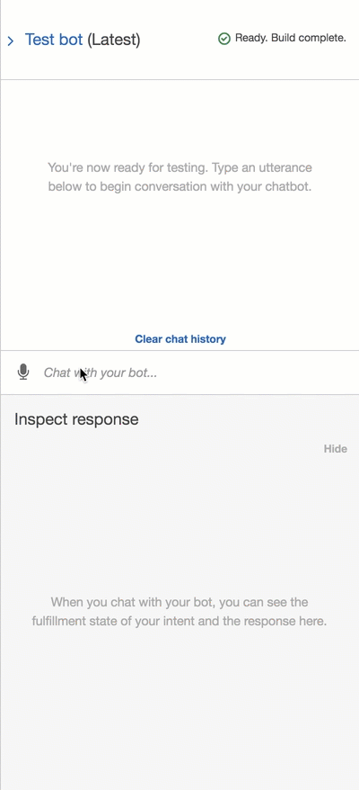

# Extended Crypto Converter

Customers just loved the new chatbot to convert from dollars to Bitcoin; however, people started to ask about some other cryptocurrencies. After reviewing the logs of the conversations, you realized that customers are interested in Bitcoin, Ethereum, and Ripple, so you decide to extend your crypto converter to allow customers to convert from dollars to one of these three cryptocurrencies.

## Instructions

### Create a custom slot

1. Log-in to the AWS Management Console using your `administrator` user, navigate to the Amazon Lex console and create a new custom slot in the `convertCAD` intent of the `Crypto_Converter` bot as follows:

    * **Slot type name:** `Cryptocurrency`

    * **Description:** `Available cryptocurrencies to convert.`

    * **Slot Resolution:** Choose "Restrict to Slot values and Synonyms".

    * **Value:** Add three values and synonyms, one per each of the following cryptocurrencies.

      | Value | Synonym |
      |-------|---------|
      | Bitcoin | BTC |
      | Ethereum | ETH |
      | Ripple | XRP |

    

2. Back in the `convertCAD` intent editor, you will note that a new slot named `slotThree` was added with the `CryptoCurrency` slot type.

    

    Change the name of the `slotThree` to `crypto`, set the prompt as `What cryptocurrency do you want to convert to?` and be sure the "Required" checkbox is selected.

    

3. To use your new `crypto` slot on the bot's conversation, modify the utterances to have the following "Sample utterances."

    * `I want to invest in cryptocurrencies`

    * `I want to convert dollars to a cryptocurrency`

    * `I want to buy {crypto}`

    * `I want to convert CAD to {crypto}`

    * `I want to convert dollars to {crypto}`

    * `I want to convert {cadAmount} dollars to {crypto}`

    

4. Build the bot and test it in the "Test bot" window. Start with typing the sample utterance `I want to invest in cryptocurrencies` to elicit all the slots as follows.

    

5. Modify the `crypto` slot to add one response card to allow users to choose between Bitcoin, Ethereum, or Ripple. Use the following configurations:

    * **Image URL:** Upload an image to your public Amazon S3 bucket, make it publicly available and paste the object URL in this box.

    * **Title:** `Available Cryptocurrencies`

    * **Subtitle:** `Choose one crypto to convert.`

    * Add one button per cryptocurrency, as is shown below.

    

6. Build the bot and test it on the "Test bot" window. Start with typing the sample utterance `I want to invest in cryptocurrencies` to elicit all the slots as follows.

    

### Add Ethereum and Ripple conversion to Lambda

As you noticed, the bot allows users to select between Bitcoin, Ethereum, and Ripple, however, it's not making the accurate cryptocurrency conversions from dollars, now it's time to extend your Lambda function to solve this issue.

1. Open the code of your `convertCAD` Lambda function on the AWS Lambda online code editor, make a backup copy just in case you need to restore your function.

2. Create a new helper function called `get_cryptoprice(crypto)` that will receive as parameter the name of the cryptocurrency selected by the user. This function should return the price of the chosen cryptocurrency in Canadian Dollars. As a starting code, you can use the `get_btcprice()` function's code. To retrieve the current price of Ethereum and Ripple, use the following endpoints from the alternative.me Crypto API.

    * **Ethereum:** https://api.alternative.me/v2/ticker/Ethereum/?convert=CAD

    * **Ripple:** https://api.alternative.me/v2/ticker/Ripple/?convert=CAD

    **Important note:** In the JSON response from the Crypto API, every cryptocurrency has a different `ID` that needs to be passed to fetch the price in dollars. For example, in the starter code, you have the following line in the `get_btcprice()` function.

    ```python
    price_cad = parse_float(response_json["data"]["1"]["quotes"]["CAD"]["price"])
    ```

    The key `["1"]` corresponds to the `ID` for Bitcoin. So you need to change this `ID` depending on the cryptocurrency selected by the user. Ethereum `ID` is `1027`, and Ripple `ID` is `52`.

3. Modify the `convert_cad()` function as follows:

    * Add the code needed to fetch the value of the `crypto` slot.

    * Modify the following code at your convenience, to call the `get_cryptoprice()` function, and calculate the conversion from Canadian Dollars to the selected cryptocurrency.

      ```python
      btc_value = parse_float(cad_amount) / get_btcprice()
      btc_value = round(btc_value, 4)

      # Return a message with conversion's result.
      return close(
          intent_request["sessionAttributes"],
          "Fulfilled",
          {
              "contentType": "PlainText",
              "content": """Thank you for your information;
              you can get {} Bitcoins for your ${} dollars.
              """.format(
                  btc_value, cad_amount
              ),
          },
      )
      ```

4. Remove the `get_btcprice()` function - you won't need it anymore.

5. Create at least three test events, one per cryptocurrency, to validate that the code is working correctly.

6. Open the Amazon Lex console and test the bot in the "Test bot" window. Since you only made changes to Lambda, there is no need to build the bot. You should now see accurate conversions for each cryptocurrency, as it's shown below.

    

## Hints

* Remember to save your Lambda function once in a while to prevent code loses.

---
© 2020 Trilogy Education Services, a 2U, Inc. brand. All Rights Reserved.
